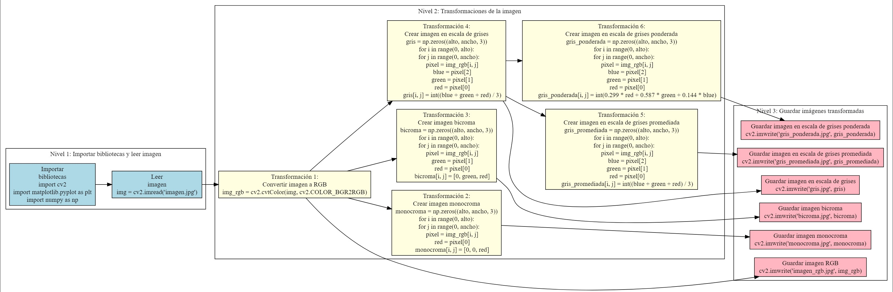

# Mapa-Mental-1---Operaciones-y-Transformaciones-de-Im-genes-
El alumno deberá realizar un mapa mental de 3 niveles considerando las operaciones y transformaciones de imágenes en pixeles, locales y globales.

# Mapa mental realizado con GraphvizOnline 
https://dreampuf.github.io/GraphvizOnline/

digraph MapaMental {
  rankdir=LR;
  node [shape=box, style=filled, fillcolor=lightblue];
  
  // Nivel 1: Importar bibliotecas y leer imagen
  subgraph cluster_nivel1 {
    label = "Nivel 1: Importar bibliotecas y leer imagen";
    node [fillcolor=lightblue];
    importar [label="Importar\nbibliotecas\nimport cv2\nimport matplotlib.pyplot as plt\nimport numpy as np"];
    leer_imagen [label="Leer\nimagen\nimg = cv2.imread('imagen.jpg')"];
  }
  
  // Nivel 2: Transformaciones de la imagen
  subgraph cluster_nivel2 {
    label = "Nivel 2: Transformaciones de la imagen";
    node [fillcolor=lightyellow];
    transformacion1 [label="Transformación 1:\nConvertir imagen a RGB\nimg_rgb = cv2.cvtColor(img, cv2.COLOR_BGR2RGB)"];
    transformacion2 [label="Transformación 2:\nCrear imagen monocroma\nmonocroma = np.zeros((alto, ancho, 3))\nfor i in range(0, alto):\n    for j in range(0, ancho):\n        pixel = img_rgb[i, j]\n        red = pixel[0]\n        monocroma[i, j] = [0, 0, red]"];
    transformacion3 [label="Transformación 3:\nCrear imagen bicroma\nbicroma = np.zeros((alto, ancho, 3))\nfor i in range(0, alto):\n    for j in range(0, ancho):\n        pixel = img_rgb[i, j]\n        green = pixel[1]\n        red = pixel[0]\n        bicroma[i, j] = [0, green, red]"];
    transformacion4 [label="Transformación 4:\nCrear imagen en escala de grises\ngris = np.zeros((alto, ancho, 3))\nfor i in range(0, alto):\n    for j in range(0, ancho):\n        pixel = img_rgb[i, j]\n        blue = pixel[2]\n        green = pixel[1]\n        red = pixel[0]\n        gris[i, j] = int((blue + green + red) / 3)"];
    transformacion5 [label="Transformación 5:\nCrear imagen en escala de grises promediada\ngris_promediada = np.zeros((alto, ancho, 3))\nfor i in range(0, alto):\n    for j in range(0, ancho):\n        pixel = img_rgb[i, j]\n        blue = pixel[2]\n        green = pixel[1]\n        red = pixel[0]\n        gris_promediada[i, j] = int((blue + green + red) / 3)"];
    transformacion6 [label="Transformación 6:\nCrear imagen en escala de grises ponderada\ngris_ponderada = np.zeros((alto, ancho, 3))\nfor i in range(0, alto):\n    for j in range(0, ancho):\n        pixel = img_rgb[i, j]\n        blue = pixel[2]\n        green = pixel[1]\n        red = pixel[0]\n        gris_ponderada[i, j] = int(0.299 * red + 0.587 * green + 0.144 * blue)"];
  }
  
  // Nivel 3: Guardar imágenes transformadas
  subgraph cluster_nivel3 {
    label = "Nivel 3: Guardar imágenes transformadas";
    node [fillcolor=lightpink];
    guardar1 [label="Guardar imagen RGB\ncv2.imwrite('imagen_rgb.jpg', img_rgb)"];
    guardar2 [label="Guardar imagen monocroma\ncv2.imwrite('monocroma.jpg', monocroma)"];
    guardar3 [label="Guardar imagen bicroma\ncv2.imwrite('bicroma.jpg', bicroma)"];
    guardar4 [label="Guardar imagen en escala de grises\ncv2.imwrite('gris.jpg', gris)"];
    guardar5 [label="Guardar imagen en escala de grises promediada\ncv2.imwrite('gris_promediada.jpg', gris_promediada)"];
    guardar6 [label="Guardar imagen en escala de grises ponderada\ncv2.imwrite('gris_ponderada.jpg', gris_ponderada)"];
  }
  
  // Conexiones entre los nodos
  importar -> leer_imagen;
  leer_imagen -> transformacion1;
  transformacion1 -> transformacion2;
  transformacion1 -> transformacion3;
  transformacion1 -> transformacion4;
  transformacion4 -> transformacion5;
  transformacion4 -> transformacion6;
  transformacion2 -> guardar2;
  transformacion3 -> guardar3;
  transformacion4 -> guardar4;
  transformacion5 -> guardar5;
  transformacion6 -> guardar6;
  transformacion1 -> guardar1;
}

