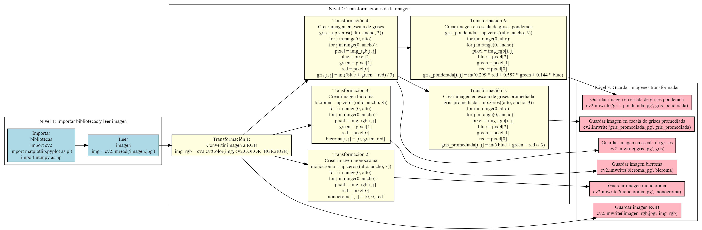

# Mapa-Mental-1---Operaciones-y-Transformaciones-de-Im-genes-
El alumno deberá realizar un mapa mental de 3 niveles considerando las operaciones y transformaciones de imágenes en pixeles, locales y globales.

# Mapa mental realizado con GraphvizOnline 
https://dreampuf.github.io/GraphvizOnline/

